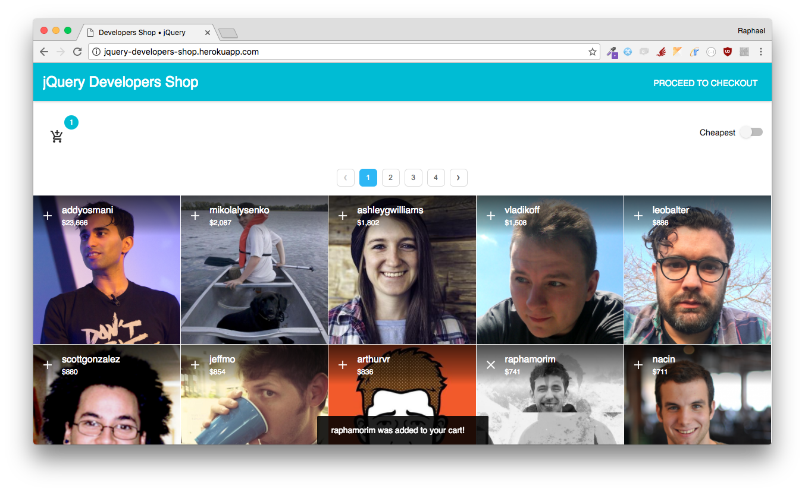

# Redux SSR Shopping Cart 

> A complete sample of React + Redux + Server Side Render + GraphQL + Express + MongoDB

[See it running](http://jquery-developers-shop.herokuapp.com/)



## Summary

- [Structure](#structure)
- [Setup & Run](#setup--run)
  - [Setup](#setup)
  - [Build](#build)
  - [Up Mongo](#up-mongo)
  - [Running](#running)
- [Ecosystem](#ecosystem)
  - [Redux](#redux)
  - [MongoDB](#mongodb)
  - [GraphQL](#graphql)
  - [Express](#express)


## Structure

```
/
 /dist -- build files
  /assets -- assets bundled from our build step
   /stylesheet
   	base.css -- reset and ref styles
   bundle.js -- bundled client
  server.js -- bundled server
 /src -- source files
  /app -- our React components
   /actions
   /components
   /constants
   /containers
   /data
   /reducers
   index.js -- root component wrapped with `react-dom/render`
  /config -- mongo configuration
  /server -- our express server
   /models -- mongoose models
   /routes -- express routes
   /schemas -- generate graphql schemas
   template.js -- our basic HTML template
  index.js -- our express server
```

## Setup & Run

#### Setup

This setup routine will install/check all dependencies (including [nodejs](http://nodejs.org), [npm](http://npmjs.com), [nvm](https://github.com/creationix/nvm) and [yarn](https://yarnpkg.com/)).

```sh
$ make install
```

Also, you can run `make setup_upgrade` to upgrade project dependencies and `make clean` to delete project dependencies.

#### Build

The above command uses the [webpack](https://webpack.github.io/) to build `server` and `bundle` files (then you'll be able to use all ES6 features in server too, but you can turn off this later).

```sh
$ make build
```

To enter in developer mode (watching files and build for every change) you can run: `make watch`.

Production Note: use `make build-prod` to force `production` environment for bundle process.

#### Up Mongo

You need to have [MongoDB](mongodb.com) installed, then you need to run in a separeted process:

```sh
$ mongod
```

#### Running

```
$ make run
```

## Ecosystem

#### Redux

Redux is a predictable state container for JavaScript apps. It helps you write applications that behave consistently, run in different environments (client, server, and native), and are easy to test. You can use Redux together with React, or with any other view library.

You can [learn more about Redux here](https://github.com/brillout/awesome-redux).

#### MongoDB

MongoDB is a free and open-source cross-platform document-oriented database program. Classified as a NoSQL database program, MongoDB uses JSON-like documents with schemas. 

MongoDB supports field, range queries, regular expression searches. Queries can return specific fields of documents and also include user-defined JavaScript functions. Queries can also be configured to return a random sample of results of a given size. Fields in a MongoDB document can be indexed with primary and secondary indices.

You can [learn more about MongoDB here](https://github.com/ramnes/awesome-mongodb).

#### GraphQL

GraphQL is a data query language developed internally by Facebook in 2012 before being publicly released in 2015. It provides an alternate to REST and ad-hoc webservice architectures.

You can send a GraphQL query to your API and get exactly what you need, nothing more and nothing less. GraphQL queries always return predictable results. Apps using GraphQL are fast and stable because they control the data they get, not the server.

You can [learn more about GraphQL here](http://graphql.org/).

#### Express

Express is a minimal and flexible Node.js web application framework that provides a robust set of features for web and mobile applications.

You can [learn more about Express here](http://expressjs.com/).